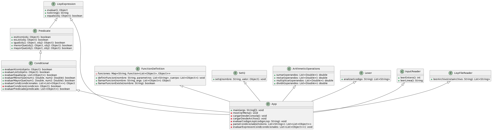

# Interpreter de LISP en Java

Este proyecto consiste en un intérprete de Lisp implementado en Java. Proporciona funcionalidades para cargar y evaluar código Lisp tanto desde la consola como desde archivos, así como también para definir funciones y realizar operaciones aritméticas.

## Requisitos

- **Java Development Kit (JDK):** Se requiere JDK 17 o superior para ejecutar la aplicación.

## Características principales

- **Carga de código Lisp:** Permite cargar código Lisp tanto desde la consola como desde archivos.
- **Evaluación de expresiones:** Evalúa expresiones Lisp, incluyendo operaciones aritméticas, llamadas a funciones y expresiones condicionales (COND).
- **Definición de funciones:** Permite definir nuevas funciones Lisp utilizando la sintaxis `defun`.
- **Soporte para predicados:** Incluye predicados como `ATOM`, `LIST`, `EQUAL`, `<`, y `>`.
- **Interfaz de usuario intuitiva:** La aplicación cuenta con un menú interactivo que facilita la carga y evaluación del código Lisp.

## Diagrama UML


## Instrucciones de uso

1. **Cargar código desde la consola:**
   - Ejecutar la aplicación y seleccionar la opción para cargar código desde la consola.
   - Ingresar el código Lisp en la consola y presionar Enter para evaluarlo.

2. **Cargar código desde un archivo:**
   - Seleccionar la opción para cargar código desde un archivo.
   - Ingresar la ruta del archivo que contiene el código Lisp.

3. **Definir funciones:**
   - Utilizar la sintaxis `(defun nombre (parámetros) cuerpo)` para definir nuevas funciones.
   - Las funciones definidas pueden ser llamadas posteriormente en el código Lisp cargado.

4. **Predicados disponibles:**
   - `ATOM`: Verifica si un objeto es un átomo.
   - `LIST`: Verifica si un objeto es una lista.
   - `EQUAL`: Compara dos objetos para verificar si son iguales.
   - `<`: Verifica si el primer argumento es menor que el segundo.
   - `>`: Verifica si el primer argumento es mayor que el segundo.

## Ejemplos

### Cargar código desde la consola:

```
Menú:
1. Cargar código LISP desde la consola
2. Cargar código LISP desde un archivo
Seleccione una opción:
1
Ingrese el código Lisp:
(+ 2 3)
Resultado de la evaluación: 5
```

<<<<<<< HEAD
### Definir variables con setq:

```lisp
; Definir una variable con valor inicial
(setq num1 10)
```

### Utilizar predicados:

```lisp
; Verificar si 'a' es un átomo
(ATOM 'a)

; Verificar si '(a b c)' es una lista
(LIST '(a b c))

; Comparar si 2 y 2 son iguales
(EQUAL 2 2)

; Verificar si 3 es menor que 5
(< 3 5)

; Verificar si 10 es mayor que 5
(> 10 5)
```

## Integrantes

- **Ihan Gilberto Alexander Marroquín Sequén (23108)**
- **Diego Fernando Patzán Marroquín (23525)**
- **Osman Emanuel de Leon Garcia (23428)**


